<!-- ### 

 -->

# 💫 About Me:

<h3 align="center"><strong>Full Stack Developer 👨🏻‍💻 con formación docente y experiencia en liderazgo como responsable de hogar de personas con discapacidad. 🧑🏻‍🏫</strong></h3>
<h4 align="center">Soy una persona en constante crecimiento personal y profesional 📈 , responsable, perseverante y capaz de resolver nuevos desafíos.</h4>
<h4 align="center">Mi trayectoria en el campo de la educación me ha brindado valiosas habilidades en el manejo de grupos, la organización, el trabajo en equipo, la escucha activa y la atención a las necesidades individuales.</h4>

  <h4><strong>Connect with me:</strong></h4>
  

    
    
    
  

# 💻 Tech Stack:

 
<!-- html -->
 
<!-- css -->
 
<!-- js -->
  
<!-- react -->
 
<!-- redux -->
 
<!-- nodejs -->
 
<!-- express -->
 
<!-- postressql -->
 
<!-- materialUI -->
 
<!-- Tailwind --> 
 

<!-- 
<h4 align="center"><strong>And also learning:</strong> React Native - Angular - Python</h4> -->

  

# 📊 GitHub Stats:

 
 

<!--VISITAS DE USUARIOS ---
 -->

# 🗂️ Projects
## DevPool

~~~
📌 Final group project of Bootcamp Henry.

Developer app allows you to:
Stay updated with the latest tech news.
Interact with the community through the forum.
Search for job opportunities and apply as desired.

This project includes:
✔ Localstorage
✔ Payment gateway
✔ Cloudinary
✔ Dashboard
✔ Soft delete
✔ Deploy
✔ Third-party authentication
✔ Form validations
✔ Combined filters
✔ Email notifications
✔ Forum

Tech Utils:
🔹 Javascript
🔹 Front: React JS, Redux, Tailwind, Material-UI
🔹 Back: NodeJs, Express, Sequelize
🔹 Database: PostgreSQL
~~~

<h2>
Login --- Register
</h2>

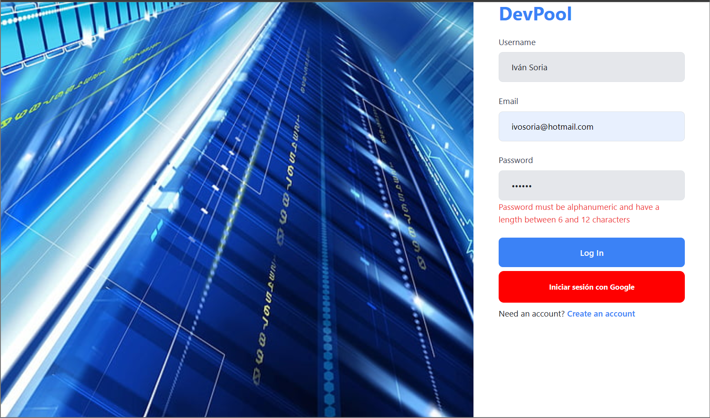
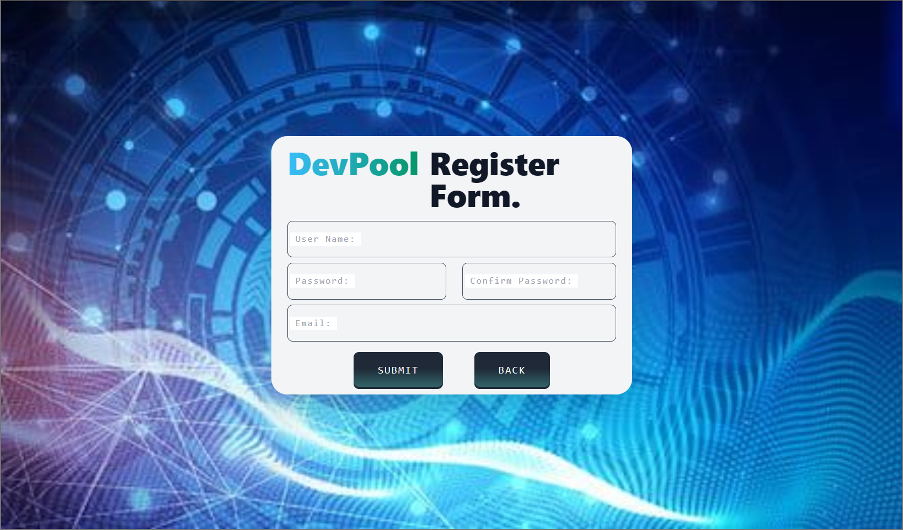

<h2>
Tech News --- Create News
</h2>

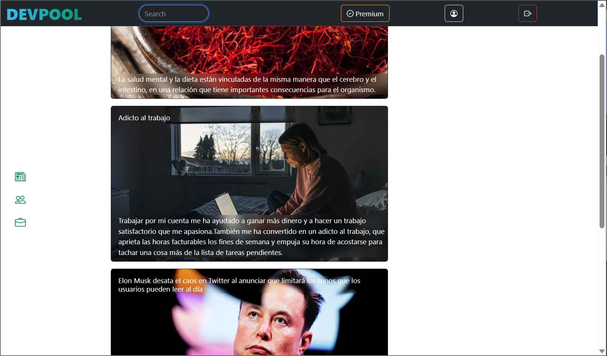
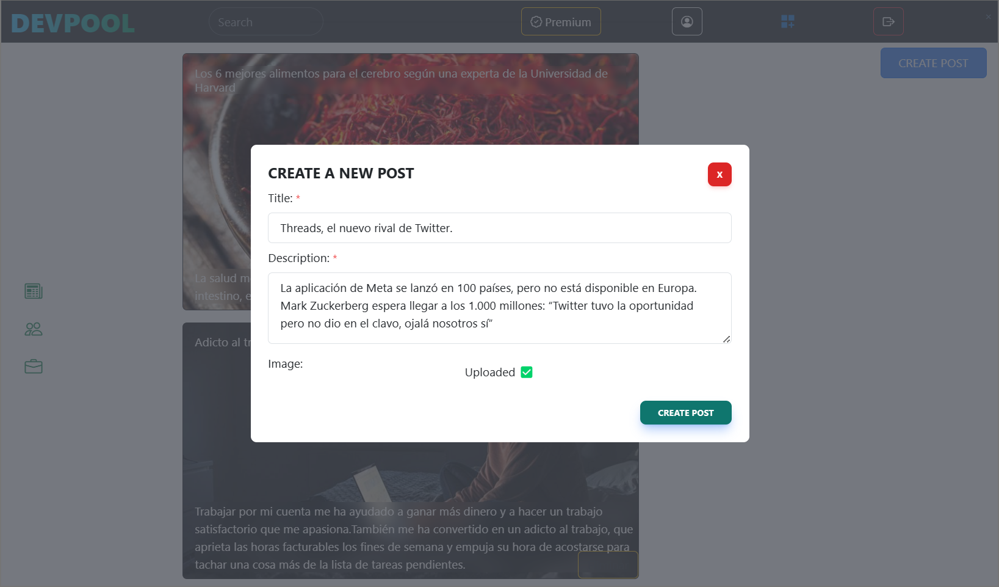  

<h2>
Forum --- Modify or delete post
</h2>

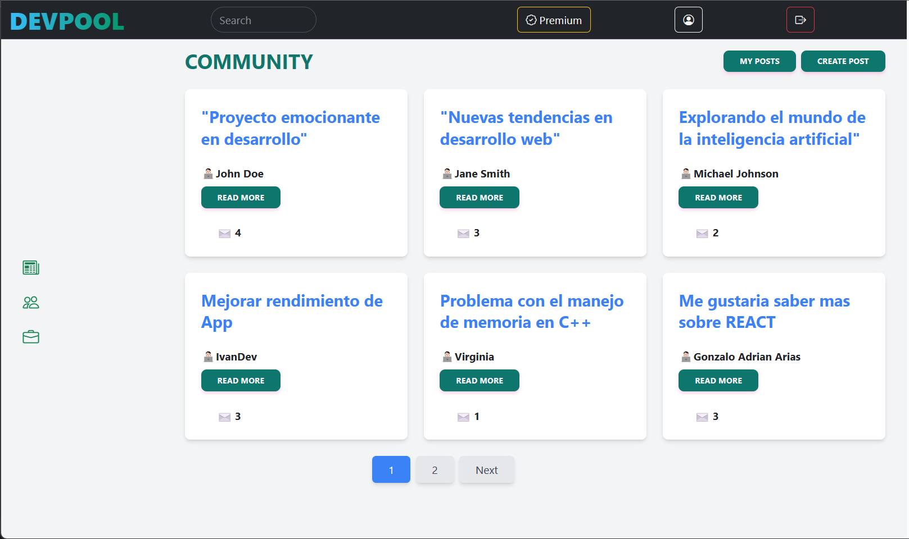
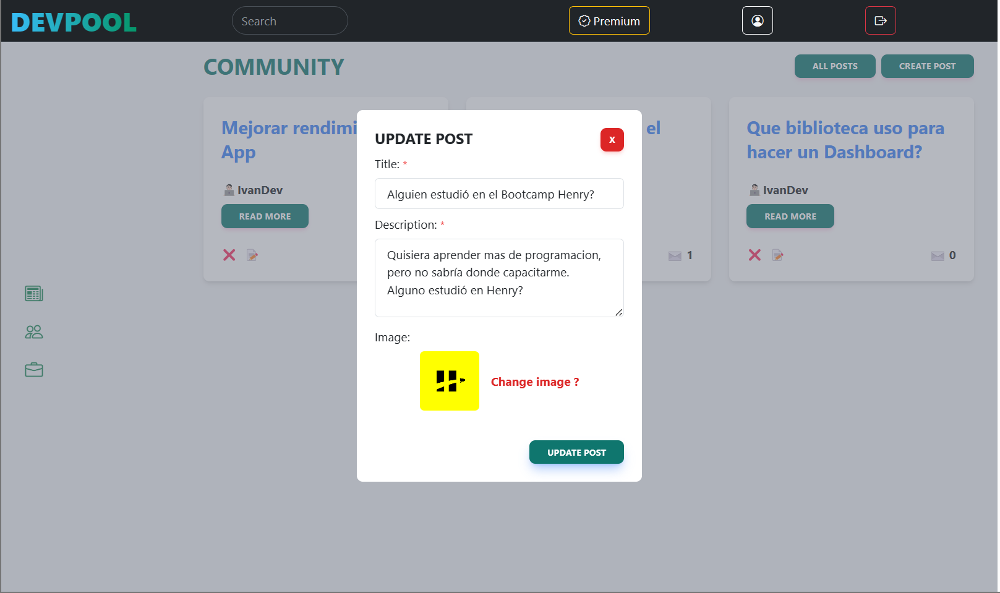

<h2>
Detail post --- Comments
</h2>

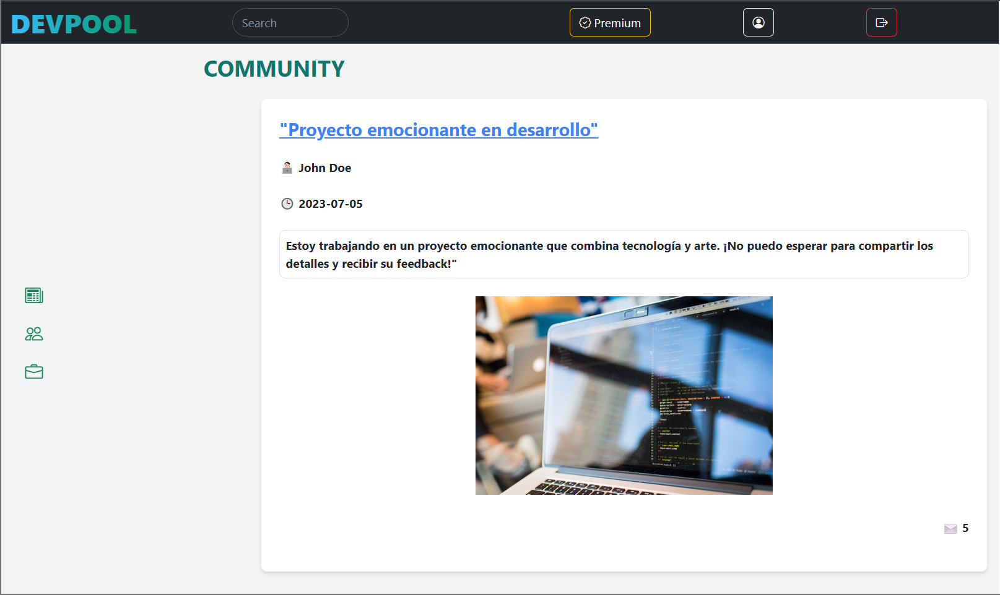
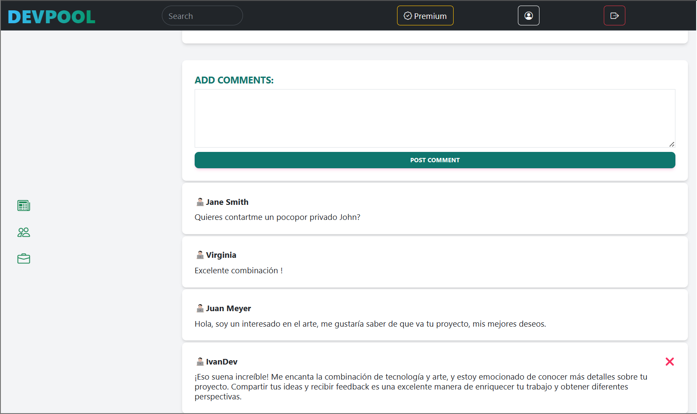

<h2>
Jobs Offers --- Job Application
</h2>

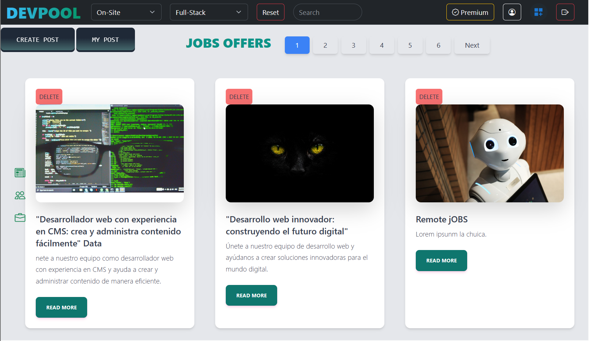
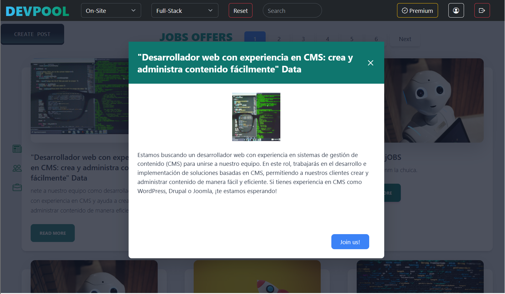

<h2>
Dashboard (dark) --- Change the role
</h2>

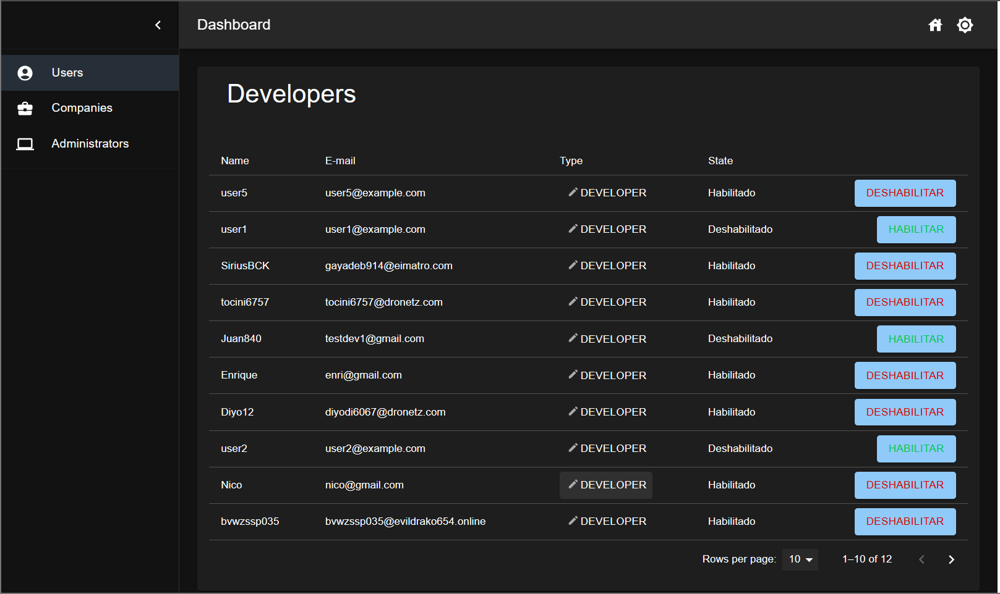
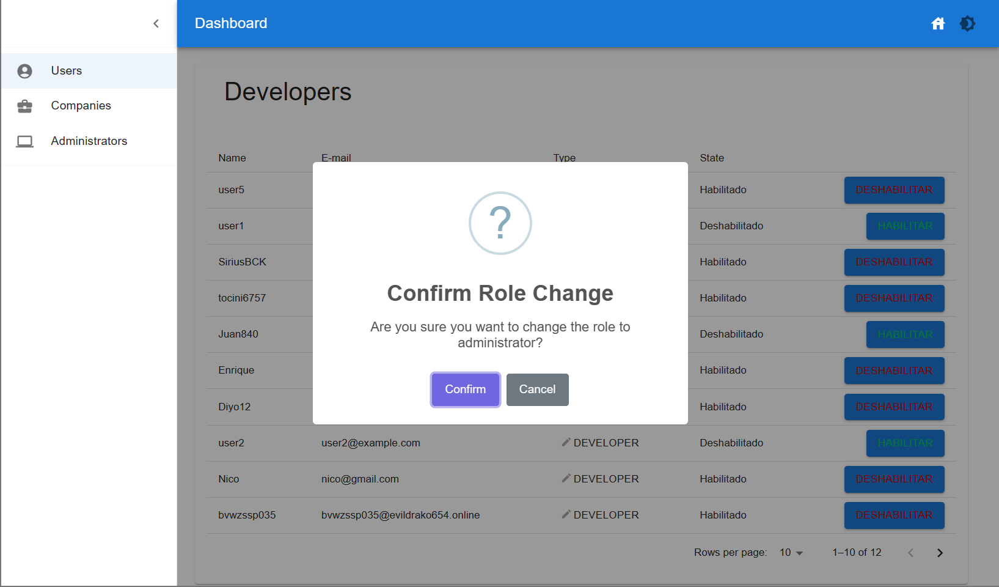

## 🎮 Videogames App 

~~~
📌 Henry Bootcamp Individual Project 

Design and develop a web page about videogame including:
✔ Loading page
✔ Searchbar
✔ Landing page
✔ Filtering, Sorting and Pagination
✔ Videogames detail
✔ Option to create a new videogame
✔ Form validations

Tech Utils: 
🔹 Javascript
🔹 Front: React, Redux, plain CSS .
🔹 Back: Node.js, Express , Sequelize.
🔹 Database: PostgreSQL.

~~~

<!-- 

 -->

## 🎬 Rick And Morty App 

~~~
📌 Henry Bootcamp Individual Project 

Design and develop a web page about Rick And Morty including:
✔ Local authentication
✔ Favorite character option
✔ Landing page
✔ Searchbar
✔ Filtering, Sorting and Pagination
✔ Character´s detail
✔ Option to create a new character
✔ Form validations
  

Tech Utils: 
🔹 Javascript
🔹 Front: React, Redux, plain CSS .
🔹 Back: Node.js, Express , Sequelize.
🔹 Database: PostgreSQL.

~~~
<!-- 

 -->

# 📫 Contact Me:

